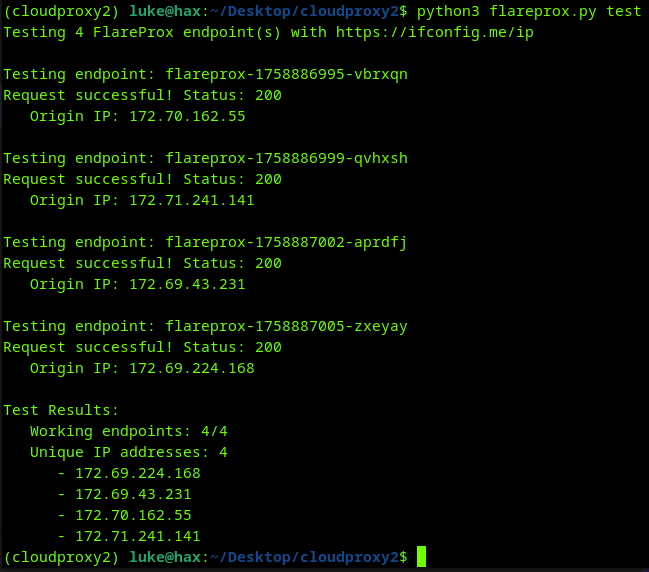

# FlareProx 🔥

**Simple IP Rotation & URL Redirection via Cloudflare Workers** 

FlareProx automatically deploys HTTP proxy endpoints on Cloudflare Workers for easy redirection of all traffic to any URL you specify. It supports all HTTP methods (GET, POST, PUT, DELETE, etc.) and provides IP masking through Cloudflare's global network. 100k requests per day are free!

## Features

- **HTTP Support**: All HTTP methods (GET, POST, PUT, DELETE, PATCH, OPTIONS, HEAD)
- **Simple URL Redirection**: Provide any URL and FlareProx redirects traffic through Cloudflare
- **Global Network**: Leverage Cloudflare's worldwide CDN infrastructure
- **Free Tier**: 100,000 requests per day on Cloudflare's free plan
- **Easy Deployment**: Single command deployment and management

## How It Works

FlareProx deploys Cloudflare Workers that act as HTTP proxies. When you make a request:

1. **Request Routing**: Your request is sent to a FlareProx endpoint
2. **URL Extraction**: The Worker extracts the target URL from query params or custom HTTP header
3. **Request Proxying**: The Worker forwards your request to the target URL
4. **Response Relay**: The target's response is relayed back through Cloudflare
5. **IP Masking**: Your original IP is masked by Cloudflare's infrastructure

## Screenshots
### Create Proxies:

### Test Proxies:

### Using a Proxy with BurpSuite:


## Quick Start

### 1. Install Dependencies
```bash
git clone <repository-url>
cd flareprox
pip install -r requirements.txt
```

### 2. Configure Cloudflare Access

Run `python3 flareprox.py config` or directly edit `flareprox.json` in the project directory:
```json
{
  "cloudflare": {
    "api_token": "your_cloudflare_api_token",
    "account_id": "your_cloudflare_account_id"
  }
}
```

### 3. Deploy Proxy Endpoints
```bash
# Create 2 proxy endpoints
python3 flareprox.py create --count 2

# View deployed endpoints
python3 flareprox.py list
```

### 4. Use Your Proxies
```bash
# Test all endpoints are functioning
python3 flareprox.py test

# Example per HTTP Method

# GET request
curl "https://your-worker.account.workers.dev?url=https://httpbin.org/get"

# POST request with data
curl -X POST -d "username=admin" "https://your-worker.account.workers.dev?url=https://httpbin.org/post"

# PUT request with JSON
curl -X PUT -d '{"username":"admin"}' -H "Content-Type: application/json" \
  "https://your-worker.account.workers.dev?url=https://httpbin.org/put"

# DELETE request
curl -X DELETE "https://your-worker.account.workers.dev?url=https://httpbin.org/delete"
```
Each deployed FlareProx endpoint accepts requests in two formats:

```bash
# Query parameter
curl "https://your-worker.account.workers.dev?url=https://httpbin.org/ip"

# Custom header
curl -H "X-Target-URL: https://httpbin.org/ip" https://your-worker.account.workers.dev
```

### 5. Proxy Cleanup
```bash
# Delete all proxy endpoints
python3 flareprox.py cleanup
```


## Getting Cloudflare Credentials

### Cloudflare Workers Setup
1. Sign up at [Cloudflare](https://cloudflare.com)
2. Go to [API Tokens](https://dash.cloudflare.com/profile/api-tokens)
3. Click 'Create Token' and use the 'Edit Cloudflare Workers' template
4. Set the 'account resources' and 'zone resources' to all. Click 'Continue to Summary'
5. Click 'Create Token' and copy the token and your Account ID from the dashboard


## Programmatic Usage

FlareProx can be imported and used directly in your Python applications. Here's how to send a POST request:

```python
#!/usr/bin/env python3
from flareprox import FlareProx, FlareProxError
import json

# Initialize FlareProx
flareprox = FlareProx(config_file="flareprox.json")

# Check if configured
if not flareprox.is_configured:
    print("FlareProx not configured. Run: python3 flareprox.py config")
    exit(1)

# Create some endpoints if none exist
endpoints = flareprox.sync_endpoints()
if not endpoints:
    print("Creating proxy endpoints...")
    flareprox.create_proxies(count=2)

# Make a POST request through FlareProx
try:
    # Prepare POST data
    post_data = json.dumps({
        "username": "testuser",
        "message": "Hello from FlareProx!",
        "timestamp": "2025-01-01T12:00:00Z"
    })

    headers = {
        "Content-Type": "application/json",
        "User-Agent": "FlareProx-Client/1.0"
    }

    # Send POST request via random FlareProx endpoint
    response = flareprox.redirect_request(
        target_url="https://httpbin.org/post",
        method="POST",
        headers=headers,
        data=post_data
    )

    if response.status_code == 200:
        result = response.json()
        print(f"✓ POST successful via FlareProx")
        print(f"Origin IP: {result.get('origin', 'unknown')}")
        print(f"Posted data: {result.get('json', {})}")
    else:
        print(f"Request failed with status: {response.status_code}")

except FlareProxError as e:
    print(f"FlareProx error: {e}")
except Exception as e:
    print(f"Request error: {e}")
```


## Use Cases

- **API Development**: Test APIs through different IP addresses
- **Web Scraping**: Route requests through Cloudflare's network
- **Security Testing**: Mask your origin IP during testing
- **Load Testing**: Distribute requests across multiple endpoints
- **Privacy**: Add an extra layer between your requests and target servers

## Disclaimer

FlareProx is designed for legitimate development, testing, and research purposes. Users are responsible for ensuring their usage complies with applicable laws and terms of service. The authors assume no liability for misuse of this tool.

---
